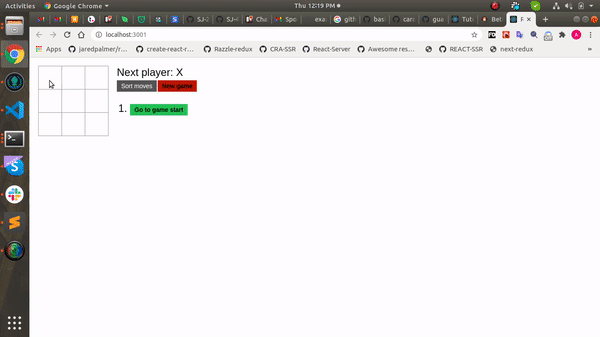

# test-react

### Instructions

Here I have created a base code for this game. code does have all css and some structure set to render squares.
But it has some errors and some pending code to do. So I have set a base of code with some minimal requirenment.
You have to complete this game code using your own logic inside it's relavent functions.

### Points to cover.

- Display the location for each move in the format (col, row) in the move history list.

- Bold the currently selected item in the move list.

- Add a toggle button that lets you sort the moves in either ascending or descending order.

- When someone wins, highlight the three squares that caused the win.

- When no one wins, display a message about the result being a draw.

- Add the button to re-start the game.

### Once you complete your code, generate a pull request. It will automatically deploy your app on github pages and add your code link in pull reuqest comments. you can cross verify your work by clicking on that link.
